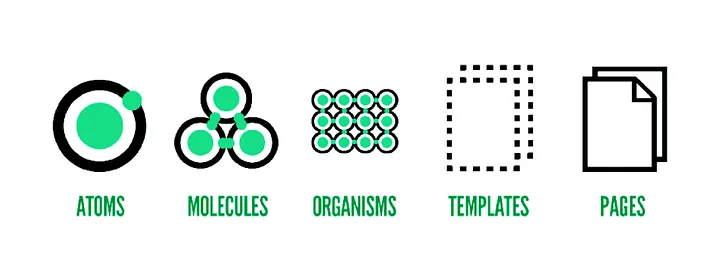

# Jar Jar Newsfeed - extended edition

BY Peter Fjordbak Poulsen

The components of the news feed application are structured according to the principles of Atomic Design, e.g.

As the application is using the Material Designs system (https://mui.com/material-ui/all-components/) many of the atoms are already provided by the library.

## Changelog

1. The project now uses the branching strategy described in the section [Branching strategy](#branching-strategy)
1. Updated dependencies to remove vulnerabilities (3 low, 5 moderate, 9 high) using npm and override typescript conflict
   1. Updated react to version 19
   1. Added dependencies and overrides needed due due to react-scripts not being maintained. Consider using e.g. next.js or vite instead
1. Renamed files to follow the naming convention for a typescript project and restructured the project folders
1. Added localizationContext and utility components for formatting date and time
1. Applied Material Design System
1. Made the layout responsive
1. Added heading to updates
1. Added dialog with form and input validation for adding new update or comment
1. Setup of linting and formatting + applying it to the code
1. Created generic sortOrderUtil that can sort by any property descending or ascending
1. Option to leave a rating on updates and comments

## Branching strategy

The project follows a standard Git Flow branching strategy. See [HERE](https://www.atlassian.com/git/tutorials/comparing-workflows/gitflow-workflow). Note that the git repository is not using the git flow extension, but vanilla git inspired by the git flow branching strategy.

## Where to start

1.  Fork this project
2.  Clone your fork
3.  Navigate to your working copy in your terminal
4.  `npm install`
5.  `npm start`
6.  Open `src/App.js` in your editor and go explore!

## Remember

- Build with reusability in mind
- Be creative
- Any code is better than no code
- Working code is better than any code
- You can use TypeScript and/or JavaScript
- You are not restricted to libraries that are currently used in this project
